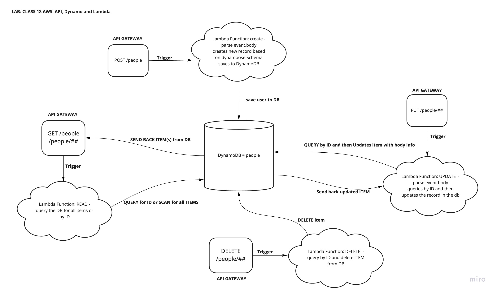

# Lab: Class 18

## Project: serverless-api

### Author: Audrey Patterson

## PR

-[Pull Request](https://github.com/arpatterson31/serverless-api/pull/1)

## UML Diagram

- UML for Lab 18 showing architecture of API

## Data and Program Flow

- What is the root URL to your API?
  - [root URL](https://7yrr0s7wk5.execute-api.us-west-2.amazonaws.com/)

- What are the routes?
  - `GET /people` - reads all items from the DB
  - `GET /people?id=##` - reads item with matching id from DB
  - `POST /people` - creates new item and adds it to the DB
  - `PUT /people?id=##` - reads item with matching id from DB and updates based on event.body info
  - `DELETE /people?id=##` - deletes item with matching id from DB

- What inputs do they require?
  - `POST /people` - requires a body that contains the following info based on schema: id(String), name(String), age(String), pronoun(String)
  - `GET /people` - requires nothing special as it returns all items
  - `GET /people?id=##` - requires the id of the item you are trying to read
  - `PUT /people?id=##` - requires the id of the item you want to update plus body information on what needs to be updated on the record
  - `DELETE /people?id=##` - requires the id of the item that you are trying to delete

- What output do they return?
  - `POST /people` - returns status code of 200 and JSON of new item added to DB based on Schema
  - `GET /people` - returns all items in DB in JSON form
  - `GET /people?id=##` - returns status code of 200 and JSON of queried item from DB
  - `DELETE /people?id=##` - will delete the item, send you back a message saying `Item deleted from DB successfully!` and empty object
  - `PUT /people?id=##` - will return a success message and an JSON object of updated item

## Links and Resources

- [Dynamoose Docs - PUT and DELETE](https://v1.dynamoosejs.com/api/model/)
